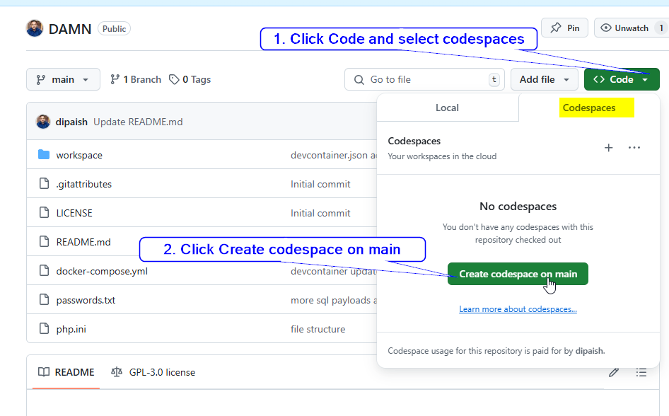
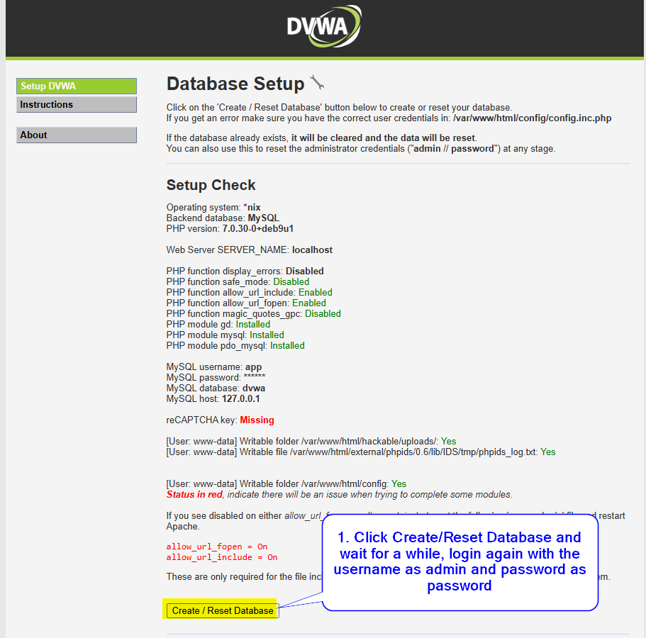

***[Know me](https://www.linkedin.com/in/kcdeepak112/)***

**QR Code for Accessing Materials**
- Scan the QR code below to access the materials quickly and conveniently.
- Alternatively, you can use the link provided in the chatbox to access the materials.


# 📝 Outline for the Session

- 📚 **Basic Introduction to Database & SQL Injection**
- 🛠️ **Practical Demo with Damn Vulnerable Web Application (DVWA)**
- 💬 **Q&A / Discussion**
- 🙋‍♂️ **Feel Free to Type or Ask Questions During the Session!**

**We’re here to learn, share, and explore together. Let’s make it interactive! 🚀**

# Database Security - SQL Injection 

## What is a database? 

- It is an organized collection of data that is stored and managed electronically. 
- It allows users and systems to efficiently retrieve, update, and manage data. 
- Databases are commonly used in various applications (Business Management Systems, Social Media Platforms, Health Management Systems)

###  Key Features of a Database
- **Data Storage**: Stores structured or unstructured data for easy access.
- **Data Management**: Enables adding, updating, and deleting data systematically.
- **Data Retrieval**: Supports queries to find and display specific information.
- **Scalability**: Handles growing amounts of data over time.
- **Data Relationships**: Links related pieces of information using tables or schemas.

### Types of Databases
1. **Relational Databases**:
   - Data is stored in structured tables with rows and columns.
   - Example: MySQL, PostgreSQL, Microsoft SQL Server.

2. **NoSQL Databases**:
   - Used for unstructured or semi-structured data.
   - Example: MongoDB, CouchDB.

3. **Cloud Databases**:
   - Hosted on cloud platforms, providing scalability and accessibility.
   - Example: AWS RDS, Google Cloud Firestore.

4. **Flat File Databases**:
   - Data is stored in plain text or spreadsheets without relationships.
   - Example: CSV files.

## Database Security

Database Security refers to the **measures and technologies** used to protect a database from **unauthorized access, misuse, corruption, and breaches**. It ensures that the **integrity, confidentiality, and availability (CIA Triad)** of data are maintained.

### Why is Database Security Important?

1. **Protecting Sensitive Information**:
   - Databases often store critical information like personal data, financial records, and trade secrets.
2. **Preventing Unauthorized Access**:
   - Restricts malicious actors or unauthorized personnel from accessing or modifying data.

3. **Ensuring Data Integrity**:
   - Protects data from being tampered with, ensuring it remains accurate and reliable.
4. **Regulatory Compliance**:
   - Many industries require data protection to meet legal standards (GDPR).
5. **Minimizing Financial and Reputational Damage**:
   - A data breach can lead to monetary loss and damage to an organization’s reputation.


## Common Threats to Database Security

1. **SQL Injection**: ***Attackers manipulate queries to gain unauthorized access or extract sensitive data.*** [Read More](https://owasp.org/Top10/A03_2021-Injection/)
2. **Unauthorized Access**: Exploiting weak passwords or unprotected access points.
3. **Malware Attacks**: Malicious software that corrupts or steals data.
4. **Insider Threats**: Employees or contractors misusing their access.
5. **Data Breaches**: Exfiltration of sensitive information by cybercriminals.


## How Databases Fit into the Cybersecurity Framework

**NIST Cybersecurity Framework**

- **Identify**: Understand where critical data is stored in the database.
- **Protect**: Implement measures like encryption, access control, and firewalls.
- **Detect**: Use monitoring tools to identify potential intrusions.
- **Respond**: Have incident response plans ready to handle database breaches.
- **Recover**: Ensure database backups are available to restore operations quickly.

## The Role of Cybersecurity Professionals in Database Security

- ***Database Administrators (DBAs) and Cybersecurity Teams work together to***:
   - Secure database infrastructure.
   - Monitor for threats and vulnerabilities.
   - Ensure compliance with data protection regulations.

- **Penetration Testers** simulate attacks to uncover vulnerabilities.

- **Incident Responders** address breaches and ensure rapid recovery.

# Recent Data Breach Incidents in Finland

## **1. Vastaamo Data Breach**
- **Timeline**:
  - **First Breach**: November 2018
  - **Second Breach**: March 2019
  - **Breaches Discovered**: October 2020
- **Nature of Attack**:
  - Unauthorized access to sensitive mental health records during 2018 and 2019.
- **Impact**:
  - Affected approximately **33,000 patients**.
  - Exposed therapy notes and personal details, leading to extortion attempts targeting both patients and the organization.
- **Consequences**:
  - Vastaamo declared bankruptcy following the breach.
  - Legislative changes in Finland were fast-tracked, allowing individuals to update their personal identity codes in cases of significant data breaches.  
  - **[Read more](https://yle.fi/a/3-11645651)**

---

## **2. Helsinki Municipality Data Breach**
- **Timeline**:
  - **Incident Date**: April 2024
- **Nature of Attack**:
  - Attackers exploited a vulnerability in the city’s education division server.
- **Impact**:
  - Initially reported to affect up to **120,000 individuals**, including students, guardians, and staff.
  - Later investigations revealed approximately **300,000 individuals** were impacted, exposing:
    - Names
    - Identification numbers
    - Addresses
- **Response**:
  - The city promptly shut down compromised systems and initiated investigations.
  - Highlighted the necessity for improved vulnerability management in municipal systems.
  - **[Read more](https://yle.fi/a/74-20124891)**

## What is SQL injection?


Img Src: https://www.cloudflare.com/img/learning/security/threats/sql-injection-attack/sql-injection-infographic.png


- It is a type of cyberattack where an attacker manipulates a web application’s SQL query by injecting malicious input into input fields (e.g., login forms, search bars)
- **How it works?**
   - Vulnerable Query: A web application executes SQL queries using user inputs without proper validation or sanitization. ```SELECT * FROM users WHERE username = 'input' AND password = 'input';```
   - Malicious Input: Exploits applications that improperly handle user input in SQL queries. An attacker provides an input like ```' OR '1'='1``` alters the intended SQL logic.
- **Common Targets**: Login forms, search bars, and any input fields interacting with a database.
- **Impacts**
   - Data theft (e.g., extracting usernames and passwords).
   - Unauthorized access (e.g., bypassing authentication).
   - Data manipulation or deletion.
   - Potential system compromise.

***SQL Injection is a critical vulnerability listed in the OWASP Top 10 security risks.***

# DAMN VULNERABLE WEB APPLICATION 

The Damn Vulnerable Web Application (DVWA) is designed to help students practice and understand some of the most common web vulnerabilities, including SQL Injection, brute force attacks, Cross-Site Scripting (XSS), and more. It provides a controlled environment for students to learn how these attacks work and explore techniques for securing applications against them.

***Warning: DVWA is intentionally insecure! Do not upload or deploy it on any publicly accessible server or web hosting service. If exposed to the internet, it will almost certainly be compromised***

# Setting Up DVWA with Docker (locally in your personal device)

You can set up DVWA (Damn Vulnerable Web Application) by forking this repository to your GitHub account and then cloning it to your local environment. This repository includes a custom `php.ini` file to ensure that all necessary PHP configurations are met for the DVWA environment.

## Prerequisites

- Ensure you have **Docker** installed and running on your device.

## Installation Steps

1. **Fork the Repository**
   - First, go to the DVWA repository on GitHub and fork it to your own GitHub account.

2. **Clone Your Forked Repository**
   - Clone the forked repository to your local device:
     ```bash
     git clone https://github.com/yourusername/dvwa.git
     ```
   - Replace `yourusername` with your GitHub username.

3. **Open the Project Directory**

4. **Start the DVWA Container**
   - Run the following command to start DVWA:
     ```bash
     docker-compose up -d
     ```
   - This will launch the DVWA container with the required environment, including the `php.ini` configuration file included in the repository to meet DVWA’s setup requirements.

5. **Access DVWA in Your Browser**
   - Open your browser and go to `http://localhost:89`.
   - Log in with the following credentials:
     - **Username**: `admin`
     - **Password**: `password`

### Notes

- **PHP Configuration**: The repository includes a custom `php.ini` file that configures essential PHP settings for DVWA. This file ensures compatibility with DVWA requirements.
- **Port Configuration**: If `localhost:89` is already in use, you can update the port in the `docker-compose.yml` file.
- **Security Warning**: DVWA is intentionally vulnerable. **Do not deploy this on any publicly accessible server**.


# Setting Up DVWA Using GitHub Codespaces  

## Installation Steps

1. **Fork the Repository**
   - Navigate to the [DVWA GitHub repository](https://github.com/dipaish/DAMN) and click the **Fork** button to create a copy of the repository under your own GitHub account.

2. **Create a Codespace**
   - Go to your forked repository in your GitHub account.
   - Click on the **Code** button, then switch to the **Codespaces** tab.
   - Click the **+** button to create a new Codespace.


3. **Run the Application**
   - Once inside the Codespace, open the terminal.
   - Run the following command to start the required services:
     ```bash
     docker-compose up -d
     ```

4. **Access the Application**
   - The necessary ports will typically open automatically.
   - If port 80 (or 89) does not open:
     - Navigate to the **Ports** tab in Codespaces.
     - Find the port associated with DVWA and click to open it in your browser.
   - Log in with username as admin and password as password. 
   - Click on Create/Reset Database
   - After a while, it will take you back to the login screen, login again. **Your application is ready.**



## Practical Tasks 

### SQL Injection Exercise

This exercise will help you understand how SQL Injection works and explore methods to prevent it.

1. **Access DVWA**:
   - Open your browser and navigate to `http://localhost:89` in localdevice, in Github codespacem you can click on the link under ports.

2. **Log In to DVWA**:
   - Use the credentials: **Username**: `admin`, **Password**: `password`.

3. **Set Security Level**:
   - Go to the **DVWA Security** tab and set the security level to **Low**.

4. **Select the SQL Injection Module**:
   - In the left sidebar, select **SQL Injection** from the list of modules.

5. **Perform a Basic SQL Injection**:
   - You will see a field where you can enter a **User ID** to retrieve information from the database.
   - Normally, entering `1` and clicking **Submit** returns information associated with User ID 1.

6. **Inject SQL Payload**:
   - Now, let’s attempt a simple SQL Injection. Instead of entering `1`, try entering:
     ```
     1' OR '1'='1
     ```
   - Click **Submit**.

7. **Analyze the Response**:
   - If the application is vulnerable, you should see multiple rows of user information returned, not just the data for User ID 1.
   - **Explanation**: The SQL query in the backend interprets `1' OR '1'='1` as always being true, causing it to retrieve all records from the database.

# SQL Injection on MySQL

| **Use Case**                      | **Payload**                                                            | **Explanation**                                                                                   | **Expected Behavior**                                                                                       |
|-----------------------------------|------------------------------------------------------------------------|---------------------------------------------------------------------------------------------------|-------------------------------------------------------------------------------------------------------------|
| **Authentication Bypass**         | `' OR '1'='1 --`                                                      | Bypasses authentication by injecting an always-true condition.                                   | Logs in successfully without valid credentials.                                                             |
| **Extract Database Version**      | `1' UNION SELECT null, @@version --`                                  | Retrieves the database version (`@@version` is MySQL-specific).                                  | Displays the MySQL version, e.g., `8.0.28`.                                                                 |
| **Retrieve Current Database Name**| `1' UNION SELECT null, database() --`                                 | Extracts the name of the currently selected database.                                             | Displays the database name, e.g., `dvwa`.                                                                   |
| **List All Tables**               | `1' UNION SELECT null, table_name FROM information_schema.tables --`  | Fetches all table names from the `information_schema.tables`.                                     | Displays a list of table names such as `users`, `logs`, etc.                                                |
| ***List Columns in a Table***       | `1' UNION SELECT null, column_name FROM information_schema.columns WHERE table_name='users' --` | Lists column names in the `users` table.                                                         | Displays column names like `id`, `username`, `password`.                                                   |
| **Time-Based Blind Injection**    | `1' AND IF(1=1, SLEEP(5), null) --`                                   | Delays response by 5 seconds if the condition `1=1` is true. Useful for blind SQL Injection.      | A 5-second delay confirms successful injection.                                                             |
| **Extract Single Character from Data** | `1' AND ASCII(SUBSTR((SELECT password FROM users LIMIT 1), 1, 1)) > 65 --` | Retrieves the ASCII value of the first character in the password of the first user.              | Helps reconstruct passwords character by character through binary search.                                   |
| **Boolean-Based Blind Injection** | `1' AND (SELECT LENGTH(password) FROM users WHERE username='admin') = 8 --` | Checks if the password length for the user `admin` is 8 characters.                              | Returns a valid response if the length is correct, otherwise no response.                                   |

---

[**Read More- Testing for SQL Injection OWSAP**](https://owasp.org/www-project-web-security-testing-guide/latest/4-Web_Application_Security_Testing/07-Input_Validation_Testing/05-Testing_for_SQL_Injection)

# Basic Union-Based Injection to Retrieve Usernames and Passwords

 ```sql
 1' UNION SELECT null, user, password FROM users --
```

***It will result in an error, that is we need to determine exact number of columns in the original query.***

 ```sql
1' ORDER BY 3 --
1' ORDER BY 2 --
```

***Adjust the number after ORDER BY until you no longer get an error. This determines the number of columns in the original query.***

**After we know the exact number of columns (in this case 2), we update our query**

```sql
1' UNION SELECT user, password FROM users --
```

**Explanation:**

- The payload uses UNION SELECT to combine the query's output with data from the users table.
- user and password are column names in the users table.
- The -- comment syntax ignores the rest of the original query.

# How to Prevent SQL Injection ??

After observing this vulnerability, lets go through how SQL Injection could be mitigated:

1. **Avoid Direct Query Embedding**: Never concatenate user inputs directly into SQL queries.
2. **Always Use Prepared Statements**: They separate SQL logic from data, preventing malicious execution.
3. **Adopt Secure Coding Practices**: Follow the OWASP Top 10 guidelines to mitigate injection attacks.

4. **Input Validation**: Only allow specific, expected formats ( ensure only integers are allowed for IDs) to prevent malicious input from altering SQL queries.

5. **Escaping Special Characters**: Escape special characters like quotes to prevent user inputs from being interpreted as part of the SQL command.

6. **Limit Database Privileges**

7. **Use Web Application Firewalls (WAF)**: A WAF can detect and block malicious SQL queries in HTTP requests.

8. **Error Handling**: Configure applications to show generic error messages and prevent attackers from gaining insight into the database structure through error messages.

9. **Input Length Constraints** :  VARCHAR(50)

10. **Keep Software Updated**

11. **Regular Security Testing**: Use automated tools like SQLMap, Burp Suite, or OWASP ZAP to test for SQL Injection vulnerabilities.

12. **Educate Developers**: Secure coding practices are critical for preventing vulnerabilities. Encourage adherence to secure coding standards (e.g., OWASP Top 10).


## Important Notes

### Ethical Considerations
- Always ensure you have permission to test any application for vulnerabilities. DVWA is designed for educational purposes and controlled testing.
### Security Levels
- DVWA supports different security levels (Low, Medium, High). Start with "Low" to understand vulnerabilities, then increase the level to explore mitigation techniques.
### Testing Environment
- Perform these tests in a safe, isolated environment like DVWA to avoid any legal or ethical issues.


## Recommended Resources & Furhter Learning for Database Security

#### OWASP Top 10 Database Security Risks
- **Description**: Covers injection attacks, misconfigurations, and access control vulnerabilities as they relate to databases.
- **URL**: [https://owasp.org/www-project-data-security-top-10/](https://owasp.org/www-project-data-security-top-10/)
<details>
  <summary>Read More</summary>
  OWASP provides an in-depth guide on common vulnerabilities affecting databases, including injection flaws, broken authentication, and misconfigurations. It highlights both risks and best practices for securing sensitive data.
</details>

---

#### NIST Cybersecurity Database Guidelines
- **Description**: Offers guidelines on protecting databases in compliance with global standards.
- **URL**: [https://csrc.nist.gov/](https://csrc.nist.gov/)
<details>
  <summary>Read More</summary>
  NIST’s guidelines provide comprehensive frameworks for securing databases, covering aspects like encryption, access controls, and incident response. These are particularly useful for aligning with international security standards.
</details>

---

#### Microsoft Learn: Database Security Best Practices
- **Description**: Focuses on securing Microsoft SQL Server databases and mitigating common threats.
- **URL**: [https://azure.microsoft.com/en-us/resources/cloud-computing-dictionary/what-is-database-security](https://azure.microsoft.com/en-us/resources/cloud-computing-dictionary/what-is-database-security)


# 🎉 **Thank You Very Much!** 🎉 🙋 **Q&A Starts Now** 🙋

---
# Prepared Statements

Use parameterized queries instead of directly concatenating user inputs into SQL commands. This ensures user inputs are treated as data, not executable code.

# SQL Injection Prevention: Vulnerable vs Secure Code

| **Aspect**          | **Vulnerable Code**                                                                                          | **Secure Code (Using Prepared Statements)**                                                     |
|----------------------|-------------------------------------------------------------------------------------------------------------|-------------------------------------------------------------------------------------------------|
| **Input Handling**   | Directly embeds user input into the query.                                                                  | Uses placeholders and binds user input securely.                                               |
| **SQL Query**        | ```php                                                                                                      | ```php                                                                                         |
|                      | $username = $_GET['username'];                                                                             | $username = $_GET['username'];                                                                 |
|                      | $query = "SELECT * FROM users WHERE username = '$username'";                                               | $stmt = $mysqli->prepare("SELECT * FROM users WHERE username = ?");                            |
|                      | $result = $mysqli->query($query);                                                                          | $stmt->bind_param("s", $username);                                                             |
|                      |                                                                                                            | $stmt->execute();                                                                              |
|                      |                                                                                                            | $result = $stmt->get_result();                                                                 |
|                      | ```                                                                                                        | ```                                                                                           |
| **Vulnerability**    | Susceptible to SQL Injection if `$username` includes malicious input like: `' OR '1'='1 --`.               | Input is treated as data, not executable SQL, even with malicious payloads.                   |
| **Security Mechanism**| None.                                                                                                     | Uses parameterized queries (prepared statements), ensuring SQL and user input are separated.   |
| **Example of Exploit**| Malicious input:                                                                                          | Malicious input:                                                                               |
|                      | ```                                                                                                        | ```                                                                                           |
|                      | admin' OR '1'='1 --                                                                                        | admin' OR '1'='1 --                                                                           |
|                      | ```                                                                                                        | ```                                                                                           |
|                      | Result: Bypasses authentication and returns all users.                                                    | Result: No SQL Injection; treated as a literal string.                                         |

---

# SQL Injection Payloads for MySQL

| **Type of Injection**    | **Payload**                                | **Explanation**                                                                                 | **Example**                                                                                                                                   |
|---------------------------|--------------------------------------------|-------------------------------------------------------------------------------------------------|-----------------------------------------------------------------------------------------------------------------------------------------------|
| ***Union-Based***           | `1' UNION SELECT null, version(), database() --` | Combines results of multiple SELECT queries to extract information.                              | Retrieves database version and name.                                                                                                         |
| ***Error-Based***           | `1' AND CONVERT(@@version USING latin1) --` | Forces the database to generate an error that reveals details like the database version.         | Outputs an error message exposing `@@version` information.                                                                                   |
| **Boolean-Based Blind**   | `1' AND 1=1 --` <br> `1' AND 1=2 --`       | Checks how the application responds to true/false conditions to infer information.              | A valid response for `1=1` and no response for `1=2` indicate a vulnerability.                                                               |
| **Time-Based Blind**      | `1' AND IF(1=1, SLEEP(5), null) --`        | Delays server response if the condition is true to confirm successful injection.                 | A 5-second delay indicates successful injection.                                                                                             |
| **Stacked Queries**       | `1'; DROP TABLE users --`                  | Executes multiple SQL statements in one query, often leading to destructive actions.             | Deletes the `users` table if stacking is allowed.                                                                                            |
| **Second-Order**          | `test' --`                                 | Injects SQL during one interaction (e.g., registration) and exploits it in another (e.g., login). | Register with `test' --` and then log in as `test` to bypass authentication or manipulate other queries.                              

# Various types of attacks in the Damn Vulnerable Web App (DVWA)

| **Attack Type**         | **Description**                                                                 |
|--------------------------|---------------------------------------------------------------------------------|
| **SQL Injection**        | Exploits vulnerabilities in SQL queries to manipulate databases or extract data.|
| **Command Injection**    | Executes arbitrary commands on the host server via vulnerable input fields.     |
| **File Inclusion**       | Includes unauthorized files on the server, leading to data leakage or code execution. |
| **Cross-Site Scripting (XSS)** | Injects malicious scripts into web pages viewed by other users.                   |
| **Cross-Site Request Forgery (CSRF)** | Tricks authenticated users into performing unwanted actions on a website.   |
| **File Upload**          | Exploits weak file validation mechanisms to upload malicious files.             |
| **Broken Authentication**| Attacks that exploit weak or poorly implemented authentication mechanisms.      |
| **Insecure Cryptographic Storage** | Compromises sensitive data through weak or flawed encryption methods.       |
| **Security Misconfiguration** | Leverages poorly configured settings to gain unauthorized access.               |
| **Brute Force**          | Systematically guesses passwords or keys to gain unauthorized access.           |
| **Unvalidated Redirects and Forwards** | Exploits unvalidated redirects to redirect users to malicious websites.   |
| **Shell Injection**      | Executes shell commands on the server, compromising its integrity.              |
